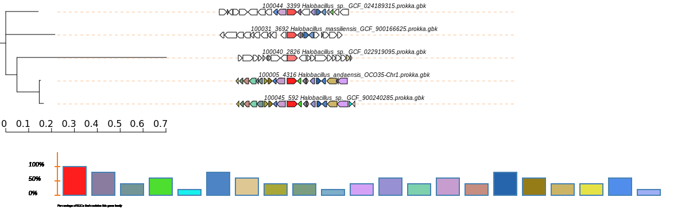

# Halobacillus

Estudio de Halobacillus, el estudio de intereses el `Halobacillus_andaensis_OCO35-Chr1`.
## Datos
Descargamos un total de 48 genomas de Halobacillus de diversas subespecies. Se encuentran anotados con Prokka. Estan en la carpeta `/home/shaday/Halobacillus/gbk/`

~~~
ls /home/shaday/Halobacillus/gbk/*gbk |wc -l
$ 49
~~~
## AntiSMASH
En esta sección utilizamos los archivos `gbk` previamente anotados y los procesamos con AntiSMASH para determinar los BGC.
Los resultados de antiSMASh los almacenamos en la carpeta 
~~~
/home/shaday/Halobacillus/antismash/
~~~
## BigSCAPE

Preparamos la carpeta
~~~
/home/shaday/Halobacillus/bigscape/bgcs_gbk
~~~
donde almacenamos todas las regiones dectectadas por antiSMASH para cada uno de los genomas.
Al correr bigscape los resultados lo guardamos en 
~~~
/home/shaday/Halobacillus/bigscape/output/todos/
~~~
## CORASON
Con las diversas familias de genes y las redes realizadas con bigscape, procedemos a usar corason, con estas familias de genes que estan conectadas con nuestro genoma de interes.

### Terpene
Del estudio previo hecho con BigScape, tenemos la siguiente familia donde nuestro organismo de interes forma parte.
[FAM_00032](##)

-   [Halobacillus_andaensis_OCO35-Chr1.prokka-c00001_gnl_CIA...region006](##)
-   [Halobacillus_sp._GCF_900240285.prokka-NZ_OESS01000003.region001](##)

Seleccionamos el gen sqhC del  Halobacillus_andaensis_OCO35-Chr1.prokka-c00001_gnl_CIA...region006 para usarlo como query para correr CORASON

`../CORASON/corason.pl -q sqhC.query -s 100005 -rast_ids Corason_Rast.IDs`

### PKSother
Agarramos PF02074 

Esta formando un cluster bastante grande  FAM_00309, donde esta formando un cluster 

-   [FAM_00309](##)
    -   [Halobacillus_alkaliphilus_GCF_900113125.prokka-NZ_FOOG01000003.region002](##)
    -   [Halobacillus_andaensis_GCF_014636475.prokka-NZ_BMEL01000001.region001](##)
    -   [Halobacillus_andaensis_GCF_017874135.prokka-c00001_NZ_JAGG...region001](##)
    -   [Halobacillus_andaensis_OCO35-Chr1.prokka-c00001_gnl_CIA...region002](##)
    -   [Halobacillus_sp._GCF_022919835.prokka-NZ_CP095074.1.region002](##)
    -   [Halobacillus_sp._GCF_022921115.prokka-NZ_CP095075.1.region001](##)
    -   [Halobacillus_sp._GCF_024189295.prokka-c00033_NZ_JAIZ...region002](##)
    -   [Halobacillus_sp._GCF_024189315.prokka-c00005_NZ_JAIZ...region001](##)
    -   [Halobacillus_sp._GCF_900240285.prokka-NZ_OESS01000002.region002](##)
    -   [Halobacillus_sp._GCF_902809865.prokka-c00001_NZ_CADD...region002](##)
### RiPPs
Esta formando un cluster bastante grande  FAM_00302, donde esta formando un cluster 

-   [FAM_00302](##)
    -   [Halobacillus_andaensis_OCO35-Chr1.prokka-c00001_gnl_CIA...region005](##)
    -   [Halobacillus_sp._GCF_024189315.prokka-c00009_NZ_JAIZ...region002](##)

### Others
Esta formando un cluster bastante grande  FAM_00304, donde esta formando un cluster 
[FAM_00304](##)

-   [Halobacillus_andaensis_GCF_014636475.prokka-NZ_BMEL01000001.region002](##)
-   [Halobacillus_andaensis_GCF_017874135.prokka-c00001_NZ_JAGG...region002](##)
-   [Halobacillus_andaensis_OCO35-Chr1.prokka-c00001_gnl_CIA...region003](##)
-   [Halobacillus_sp._GCF_022919835.prokka-NZ_CP095074.1.region001](##)
-   [Halobacillus_sp._GCF_024189315.prokka-c00005_NZ_JAIZ...region002](##)
-   [Halobacillus_sp._GCF_900240285.prokka-NZ_OESS01000002.region001](##)