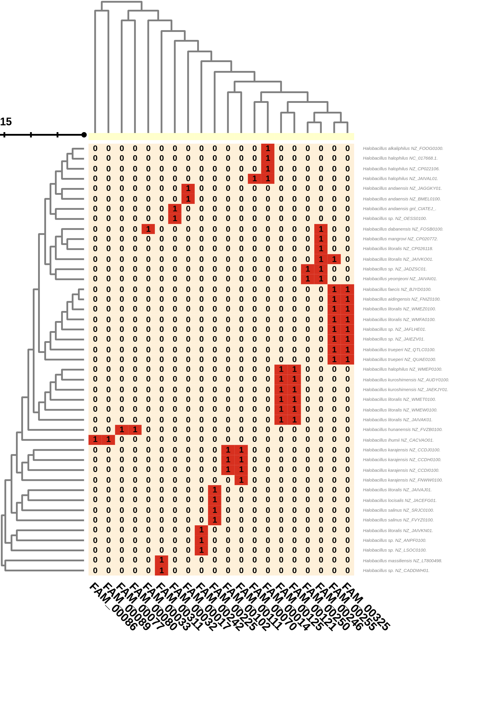

# Halobacillus

Estudio de Halobacillus, el estudio de intereses el `Halobacillus_andaensis_OCO35-Chr1`.
## Datos
Descargamos un total de 48 genomas de Halobacillus de diversas subespecies. Se encuentran anotados con Prokka. Estan en la carpeta `/home/shaday/Halobacillus/gbk/`

~~~
ls /home/shaday/Halobacillus/gbk/*gbk |wc -l
$ 49
~~~
## AntiSMASH

## [Cluster de genes biosinteticos (BGC)](https://github.com/shadayguerrero/Halobacillus/tree/main/antismash) 
En esta sección utilizamos los archivos `gbk` previamente anotados y los procesamos con **antiSMASH 6.0.0** para determinar los BGC y los resultados fueron almacenados en la carpeta [antismash](https://github.com/shadayguerrero/Halobacillus/tree/main/antismash). 

Además, usamos el script [change-names.sh](https://github.com/shadayguerrero/Halobacillus/blob/main/antismash/change-names.sh), que añade en el nombre los detalles cepa a cada una de las regiones encontradas con antiSMASH.

Encontramos 6 BGC para *Halobacillus andaensis gnl_CIATEJ_OCO35_1*, como podemos observar en la salida de [antismash](https://github.com/shadayguerrero/Halobacillus/blob/main/antismash/Halobacillus_andaensis_OCO35-Chr1.prokka/index.html), falta ver como se relacionan con los otros cluster en los diversos genomas.

## [Redes de similitud de BGC](https://github.com/shadayguerrero/Roseibaca/tree/main/bigscape)
Para identificar que grupos de BGC se estan formando y en cuales esta presente *Halobacillus andaensis gnl_CIATEJ_OCO35_1* utilizamos **BiG-SCAPE 1.1.2**, los resultados los econtramos en la siguiente carpeta [bigscpae/output](https://github.com/shadayguerrero/Halobacillus/tree/main/bigscape/output).

Una exploracion grafica de los resultados de **BiG-SCAPE** los podemos ver en [bigscpae/output/todos2/index.html](https://github.com/shadayguerrero/Halobacillus/blob/main/bigscape/output/todos2/index.html).

## CORASON
Con las diversas familias de genes y las redes realizadas con bigscape, procedemos a usar corason, con estas familias de genes que estan conectadas con nuestro genoma de interes.

### Terpene
Del estudio previo hecho con BigScape, tenemos la siguiente heatmap y las familias que se forman
#### Headmap de presencia y ausencia 
 

En la familia FAM_00032 se enceuntra presente nuestro organismo de interes, dicha familia esta formada por:

-   [FAM_00032](##)
  -   [Halobacillus_andaensis_OCO35-Chr1.prokka-c00001_gnl_CIA...region006](##)
  -   [Halobacillus_sp._GCF_900240285.prokka-NZ_OESS01000003.region001](##)

Seleccionamos el gen sqhC del  Halobacillus_andaensis_OCO35-Chr1.prokka-c00001_gnl_CIA...region006 para usarlo como query para correr CORASON

`../CORASON/corason.pl -q sqhC.query -s 100005 -rast_ids Corason_Rast.IDs`

### PKS and other
Para el BGC de PKS, tenemos el siguiente headmap de presencia y ausencia.
#### Headmap de presencia y ausencia 
 
 
 Para el BGC de PKS, en la familia FAM_00032 se encuentra presente nuestro organismo de interes, dicha familia esta formada por:

Agarramos PF02074 

-   [FAM_00309](##)
    -   [Halobacillus_alkaliphilus_GCF_900113125.prokka-NZ_FOOG01000003.region002](##)
    -   [Halobacillus_andaensis_GCF_014636475.prokka-NZ_BMEL01000001.region001](##)
    -   [Halobacillus_andaensis_GCF_017874135.prokka-c00001_NZ_JAGG...region001](##)
    -   [Halobacillus_andaensis_OCO35-Chr1.prokka-c00001_gnl_CIA...region002](##)
    -   [Halobacillus_sp._GCF_022919835.prokka-NZ_CP095074.1.region002](##)
    -   [Halobacillus_sp._GCF_022921115.prokka-NZ_CP095075.1.region001](##)
    -   [Halobacillus_sp._GCF_024189295.prokka-c00033_NZ_JAIZ...region002](##)
    -   [Halobacillus_sp._GCF_024189315.prokka-c00005_NZ_JAIZ...region001](##)
    -   [Halobacillus_sp._GCF_900240285.prokka-NZ_OESS01000002.region002](##)
    -   [Halobacillus_sp._GCF_902809865.prokka-c00001_NZ_CADD...region002](##)

Seleccionamos el dominio PF02074 presente en   Halobacillus_andaensis_OCO35-Chr1.prokka-c00001_gnl_CIA...region002 para usarlo como query para correr CORASON

`../CORASON/corason.pl -q pks-pf02074.query -s 100005 -rast_ids Corason_Rast.IDs`

### RiPPs
Esta formando un cluster bastante grande  FAM_00302, donde esta formando un cluster 

-   [FAM_00302](##)
    -   [Halobacillus_andaensis_OCO35-Chr1.prokka-c00001_gnl_CIA...region005](##)
    -   [Halobacillus_sp._GCF_024189315.prokka-c00009_NZ_JAIZ...region002](##)

### Others
Esta formando un cluster bastante grande  FAM_00304, donde esta formando un cluster 
[FAM_00304](##)

-   [Halobacillus_andaensis_GCF_014636475.prokka-NZ_BMEL01000001.region002](##)
-   [Halobacillus_andaensis_GCF_017874135.prokka-c00001_NZ_JAGG...region002](##)
-   [Halobacillus_andaensis_OCO35-Chr1.prokka-c00001_gnl_CIA...region003](##)
-   [Halobacillus_sp._GCF_022919835.prokka-NZ_CP095074.1.region001](##)
-   [Halobacillus_sp._GCF_024189315.prokka-c00005_NZ_JAIZ...region002](##)
-   [Halobacillus_sp._GCF_900240285.prokka-NZ_OESS01000002.region001](##)
